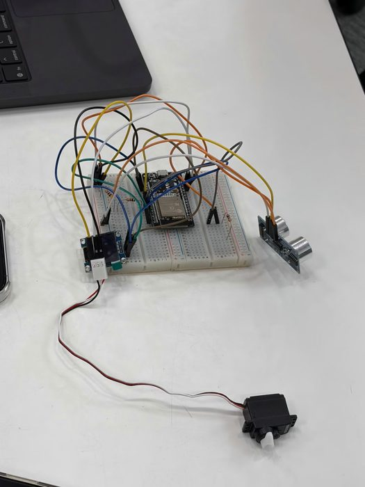
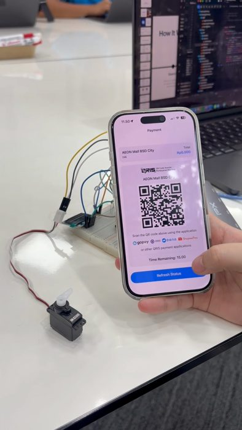
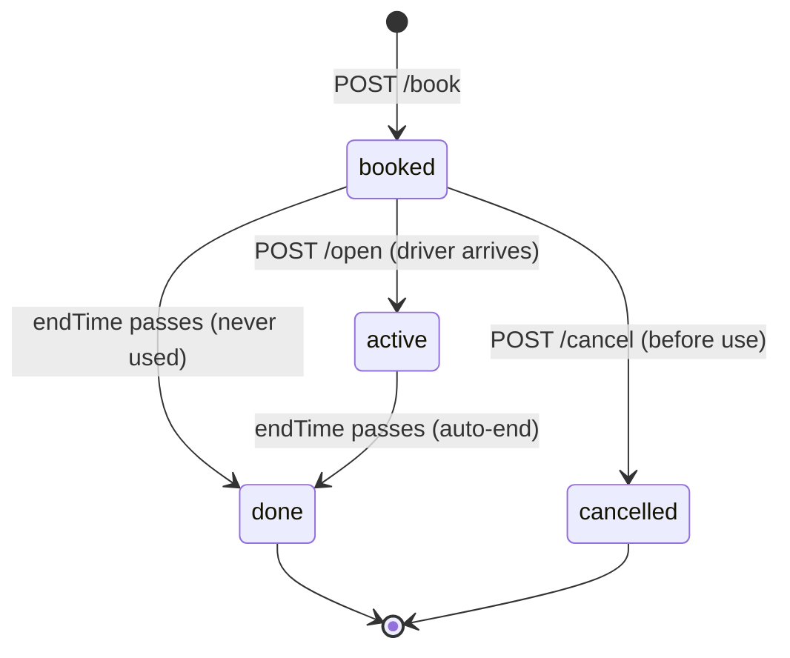

# BookPark Server

**The backend for BookPark, a smart parking reservation system: drivers book a spot in an iOS app, and a physical flap holds the spot until they arrive.**

Built for the Apple Developer Academy (Challenge 3, June to July 2026) by a team of 6. I was the backend developer and wrote everything in this repo. The iOS app and the ESP32 firmware were built by teammates; this server is the bridge between them.

<p align="center">
  
  &nbsp;
  
</p>

**▶ [Watch the demo](https://youtube.com/shorts/F142TTkJwcg)**: the iOS app and the flap prototype working together on real hardware.

**iOS app:** [gabriellaawidd/BookingParking](https://github.com/gabriellaawidd/BookingParking), built by my teammates against the API contract in [`docs/Frontend_contract.md`](docs/Frontend_contract.md).

## What it does

- **REST API for the iOS app:** users, vehicles and bookings, with validation and clear error codes (400, 403, 404, 409, 503).
- **Controls a physical flap over MQTT with TLS.** `POST /open` publishes `drop` to `flap/01/command`; the ESP32 reports its state back on `flap/01/status`.
- **Re-secures the spot automatically.** When the ultrasonic sensor reports the car has left, the server logs the exit and raises the flap. There is no "close" button for the driver to forget.
- **Ends bookings on its own.** A sweep every 30 seconds marks bookings past their end time as done.
- **Flags the one possible violation, overstay.** The flap only opens for the booker, so a car on the spot with no live booking can only mean the driver stayed too long.

## How it fits together

```
iOS app ──HTTP──► nginx ──► Node.js server ──MQTT/TLS──► HiveMQ broker ◄──► ESP32 flap + sensor
                                  │
                               SQLite
```

A booking moves through four states:



More diagrams (message flow, stall states, data model, ERD) are in [`docs/diagrams/`](docs/diagrams).

## Design decisions

- **Durable data in SQLite, live sensor data in memory.** Users, vehicles, bookings and entry/exit events survive a restart. The flap position and car presence change constantly and the flap re-reports them, so they are never stored.
- **Entries and exits are events, not columns.** A driver can leave and come back within one booking, so each entry and exit is its own row. Arrival time, departure time and actual duration are computed when read.
- **A long-running server, not serverless.** MQTT pushes messages to the server, and a serverless function has nothing listening between requests. The server runs as a persistent process in Docker.
- **Only nginx is exposed.** In Docker Compose the app container has no published port; outside traffic reaches it only through the nginx reverse proxy. For the demo, the server was exposed over HTTPS with Cloudflare Tunnel, so no inbound ports were opened.
- **Secrets stay out of the code.** Broker credentials are read from `.env`, which is gitignored and kept out of the Docker image.

## API

| Method | Path | What it does |
|---|---|---|
| `GET` | `/status` | Live flap state, presence, derived status and the overstay flag |
| `POST` | `/users` | Create a user |
| `GET` | `/users/:id` | A user with their vehicles |
| `POST` | `/vehicles` | Register a vehicle to a user |
| `GET` | `/vehicles/:id` | A vehicle |
| `POST` | `/book` | Reserve the spot for a time window (default 2 hours) |
| `GET` | `/booking/:id` | A booking with arrival, departure and actual duration |
| `POST` | `/open` | Drop the flap for a valid booking (can be called again to re-enter) |
| `POST` | `/cancel` | Cancel a booking that hasn't been used yet |

Full request and response shapes: [`docs/Frontend_contract.md`](docs/Frontend_contract.md) (app to server) and [`docs/Server_contract.md`](docs/Server_contract.md) (server to flap over MQTT).

## Run it

You need Node.js 22 and an MQTT broker (the project used HiveMQ Cloud).

```bash
cp .env.example .env      # fill in your broker details
npm install
npm start                 # http://localhost:3000
./test.sh                 # end-to-end smoke test, run against a fresh database
```

With Docker:

```bash
docker compose up --build # nginx on http://localhost:8080
```

No hardware? Run `node simulate-flap.js` in another terminal. It pretends to be the ESP32, publishes sensor status and prints the commands the server sends. `node seed.js` adds sample users and vehicles, and `flap-control.js` / `raise-flap.js` drive the flap by hand during testing.

## Project structure

```
server.js           HTTP API, MQTT handling, auto-end sweep
db.js               SQLite schema and queries (better-sqlite3)
seed.js             Sample data
simulate-flap.js    Fake ESP32 for testing without hardware
flap-control.js     Manual flap control server for testing
raise-flap.js       One-shot "raise the flap" helper
test.sh             End-to-end smoke test
Dockerfile          Node 22 image
docker-compose.yml  App + nginx, SQLite on a named volume
nginx.conf          Reverse proxy config
docs/               Contracts, backend handbook, deployment notes, diagrams
```

## What I'd improve next

- **Authentication.** The API has none yet, which was fine for a proof of concept but not for real users.
- **More than one stall.** The server is built around a single flap (`flap/01`); supporting a whole car park means keying state and topics by stall.
- **Automated tests.** `test.sh` is a manual smoke test; the booking rules deserve proper unit and integration tests.

## Tech

Node.js 22 · Express 5 · better-sqlite3 · MQTT.js over TLS · HiveMQ Cloud · Docker · nginx · Cloudflare Tunnel
